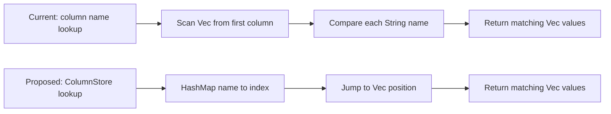
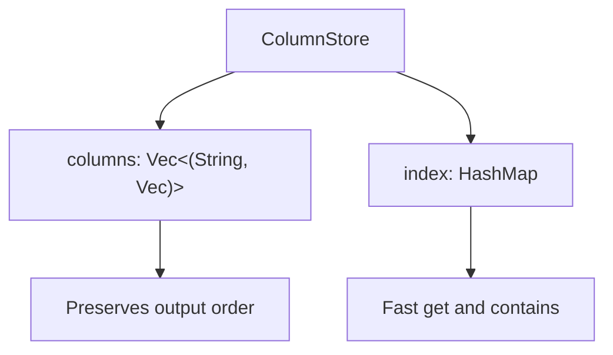
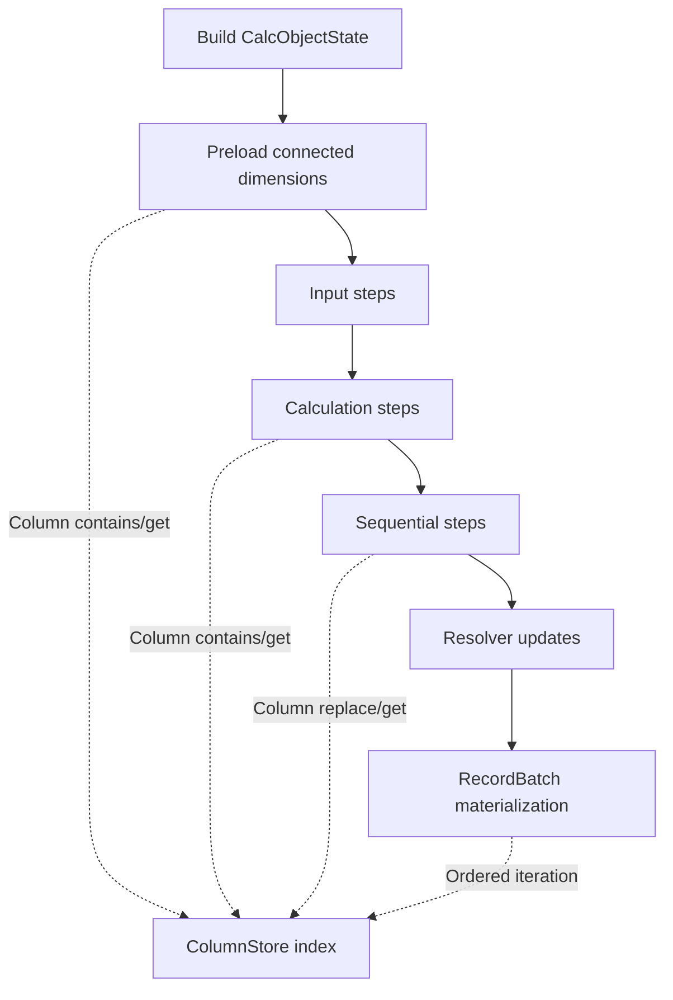

# Source Issue 7 Analysis - Add ColumnStore and Indexed Lookup

## 1. Issue Validation

### Is The Issue Valid Based On The Code?

Yes. The issue is valid and still relevant in the current Rust omni-calc execution path.

The current production execution state stores dynamic columns as ordered vectors of `(String, Vec<T>)`. This preserves output order, but it means most name-based lookups and duplicate checks are linear scans. That is acceptable for small models, but it becomes more expensive as the number of indicators, property columns, connected dimension columns, cross-object references, and lookup/filter dependencies grows.

This issue is strong enough to add as a Jira issue because:

- The code evidence directly matches the issue description.
- The affected code is in the active omni-calc executor path, not an unused prototype.
- The proposed fix is foundational and low-level enough to support later clone reduction, shared Arc storage, FormulaEvaluator refactoring, string interning, and typed IDs.
- The change can be implemented incrementally while preserving output order and existing external column names.

### Evidence From The Codebase

Current branch inspected:

```text
BLOX-2143-add-omni-calc-runtime-performance-tracing-and-benchmark-baseline
```

Primary code evidence:

```text
/Users/veerpratapsingh/Desktop/blox/Blox-Dev/modelAPI/omni-calc/src/engine/exec/state.rs
```

`CalcObjectState` currently stores columns as vectors:

```rust
pub dim_columns: Vec<(String, Vec<String>)>,
pub number_columns: Vec<(String, Vec<f64>)>,
pub string_columns: Vec<(String, Vec<String>)>,
pub connected_dim_columns: Vec<(String, Vec<String>)>,
```

The helper methods perform linear lookup:

```rust
pub fn get_number_column(&self, name: &str) -> Option<&Vec<f64>> {
    self.number_columns
        .iter()
        .find(|(n, _)| n == name)
        .map(|(_, v)| v)
}
```

Similar linear lookup exists for:

- `get_string_column`
- `get_connected_dim_column`
- filter dimension lookup
- property column lookup
- connected dimension lookup
- cross-object dependency duplicate checks
- RecordBatch materialization duplicate checks
- sequential dependency merge and replacement

### Affected Files And Functions

The issue appears in these active execution paths:

```text
/Users/veerpratapsingh/Desktop/blox/Blox-Dev/modelAPI/omni-calc/src/engine/exec/state.rs
```

Affected parts:

- `CalcObjectState`
- `new_block`
- `new_dimension`
- `get_number_column`
- `get_string_column`
- `get_connected_dim_column`
- `add_number_column`
- `add_string_column`
- `add_connected_dim_column`

```text
/Users/veerpratapsingh/Desktop/blox/Blox-Dev/modelAPI/omni-calc/src/engine/exec/context.rs
```

Affected parts:

- `build_record_batch`
- `build_record_batch_with_timing`
- duplicate field detection before Arrow `RecordBatch` creation
- schema field order construction

```text
/Users/veerpratapsingh/Desktop/blox/Blox-Dev/modelAPI/omni-calc/src/engine/exec/executor.rs
```

Affected parts:

- `preload_connected_dimensions`
- `process_calculation_step`
- `process_sequential_step`
- `process_property_node`
- `process_input_step`
- `resolve_cross_object_dependencies_for_node_with_warnings`
- `model_shape_from_context`
- helper paths that merge cross-object, property, string, and connected dimension columns

Examples currently found:

```rust
state.connected_dim_columns.iter().any(|(n, _)| n == &col_name)
state.number_columns.iter().any(|(n, _)| n == &col_name)
state.number_columns.push((col_name, values))
state.number_columns.retain(|(n, _)| n != &col_name)
state.connected_dim_columns.clone()
```

```text
/Users/veerpratapsingh/Desktop/blox/Blox-Dev/modelAPI/omni-calc/src/engine/exec/filter_utils.rs
```

Affected parts:

- `get_dimension_column`
- `get_property_column`
- `available_dimension_columns`
- `available_string_columns`

```text
/Users/veerpratapsingh/Desktop/blox/Blox-Dev/modelAPI/omni-calc/src/engine/exec/steps/sequential.rs
```

Affected part:

- `build_lookup_entity_map`

This currently searches `connected_dim_columns`, `string_columns`, and `dim_columns` linearly.

```text
/Users/veerpratapsingh/Desktop/blox/Blox-Dev/modelAPI/omni-calc/src/engine/exec/get_source_data/resolver.rs
```

Affected parts:

- connected dimension source/target column matching
- node-map merge column filtering
- source dimension column lookup

```text
/Users/veerpratapsingh/Desktop/blox/Blox-Dev/modelAPI/omni-calc/src/engine/exec/node_alignment/lookup.rs
```

Affected part:

- common dimension discovery between source and target columns

```text
/Users/veerpratapsingh/Desktop/blox/Blox-Dev/modelAPI/omni-calc/src/engine/calc_buffers/columns.rs
```

Important note:

This module has early `ColumnId`, `ColumnKey`, and `ColumnMeta` types, but it is not a production `ColumnStore<T>` and it is not integrated into the current `CalcObjectState` hot path. It should not be treated as the completed solution for this issue.

### Estimated Impact

Performance impact:

- Medium to high for wide models.
- Most visible when a block has many generated columns, connected dimensions, property columns, lookup references, or cross-object dependencies.
- Reduces repeated O(n) scans in hot execution paths.
- Helps keep column lookup and duplicate checks predictable as models scale.

Scalability impact:

- Current vector lookup cost grows with column count.
- With `ColumnStore`, common operations such as `get`, `contains`, insert, replacement, and duplicate detection become index-based.

Maintainability impact:

- Centralizes column behavior in one type.
- Reduces scattered manual duplicate checks.
- Makes later changes such as Arc-backed columns and typed column IDs easier.

Correctness impact:

- This is mainly a performance and maintainability issue, not a confirmed user-facing correctness bug.
- However, the current code allows direct vector `push`, which means duplicate columns can be introduced accidentally unless each call site remembers to check first.
- A `ColumnStore` can make duplicate handling explicit and safer.

## 2. Simple Explanation

Today omni-calc keeps calculated columns in lists.

When the engine needs a column by name, it walks through the list from the start until it finds the matching name. That is fine when there are only a few columns, but it becomes slower when a model has many indicators, dimensions, properties, and connected-dimension columns.

The fix is to keep the same ordered list for output, but also maintain a fast name-to-position index.

In simple terms:

```text
Before:
Look through every column until the name is found.

After:
Use a map to jump directly to the column position.
```

This gives us faster lookup without changing the final output order.

## 3. Technical Explanation

### Current Behavior

`CalcObjectState` uses plain vectors for dynamic columns:

```rust
Vec<(String, Vec<f64>)>
Vec<(String, Vec<String>)>
```

This gives deterministic iteration order, which is important for Arrow `RecordBatch` schema generation. But the tradeoff is that lookup by column name requires scanning the whole vector.

The current code repeatedly does:

```rust
state.number_columns.iter().any(|(n, _)| n == &col_name)
state.number_columns.iter().find(|(n, _)| n == name)
state.connected_dim_columns.iter().any(|(n, _)| n == &col_name)
```

This pattern appears inside execution loops, not only at initialization time.

### Root Cause

The root cause is that column storage currently combines two responsibilities in one structure:

1. Preserve deterministic output order.
2. Support fast lookup by column name.

A vector solves the first responsibility but not the second. Since there is no central indexed storage type, every call site either scans the vector or implements its own duplicate check.

### Why This Is A Problem

For each lookup:

```text
Current cost: O(number_of_columns)
Desired cost: O(1) average lookup through HashMap
```

In wide models, this cost is repeated many times:

- during connected dimension preload
- while adding cross-object columns
- while adding dimension property columns
- while evaluating formulas
- while building lookup maps
- while preparing resolver joins
- while materializing final RecordBatches

The problem becomes worse when later optimizations add more parallel scheduling or shared snapshot reuse, because more code will depend on predictable, reusable column access.

### What Is Already Partially Present?

There are early identifier types in:

```text
/Users/veerpratapsingh/Desktop/blox/Blox-Dev/modelAPI/omni-calc/src/engine/calc_buffers/columns.rs
```

Examples:

```rust
pub struct ColumnId(pub String);
pub struct ColumnKey {
    pub id: ColumnId,
    pub version: u64,
}
pub struct ColumnMeta {
    pub key: ColumnKey,
    pub nullable: bool,
    pub data_type: DataType,
}
```

These are useful for future typed-column work, but they do not currently replace `CalcObjectState` storage and do not solve the active hot-path lookup problem.

## 4. Proposed Fix

### Recommended Implementation Approach

Implement an ordered indexed `ColumnStore<T>` and migrate dynamic `CalcObjectState` columns to it in phases.

The key design is:

- Keep a `Vec<(String, Vec<T>)>` internally for stable output order.
- Add a `HashMap<String, usize>` index for fast lookup.
- Prevent accidental duplicate insertion.
- Allow explicit replacement where current logic intentionally replaces columns.
- Keep string column names unchanged for compatibility.

### Phase 1 - Add `ColumnStore<T>`

Create:

```text
/Users/veerpratapsingh/Desktop/blox/Blox-Dev/modelAPI/omni-calc/src/engine/exec/column_store.rs
```

Expose it from:

```text
/Users/veerpratapsingh/Desktop/blox/Blox-Dev/modelAPI/omni-calc/src/engine/exec/mod.rs
```

Example implementation shape:

```rust
use std::collections::HashMap;

#[derive(Debug, Clone, PartialEq, Eq)]
pub enum ColumnStoreError {
    DuplicateColumn(String),
}

#[derive(Debug, Clone, Default)]
pub struct ColumnStore<T> {
    columns: Vec<(String, Vec<T>)>,
    index: HashMap<String, usize>,
}

impl<T> ColumnStore<T> {
    pub fn new() -> Self {
        Self {
            columns: Vec::new(),
            index: HashMap::new(),
        }
    }

    pub fn with_capacity(capacity: usize) -> Self {
        Self {
            columns: Vec::with_capacity(capacity),
            index: HashMap::with_capacity(capacity),
        }
    }

    pub fn insert(
        &mut self,
        name: impl Into<String>,
        values: Vec<T>,
    ) -> Result<(), ColumnStoreError> {
        let name = name.into();
        if self.index.contains_key(&name) {
            return Err(ColumnStoreError::DuplicateColumn(name));
        }

        let position = self.columns.len();
        self.columns.push((name.clone(), values));
        self.index.insert(name, position);
        Ok(())
    }

    pub fn replace(&mut self, name: &str, values: Vec<T>) -> Option<Vec<T>> {
        let position = *self.index.get(name)?;
        let old_values = std::mem::replace(&mut self.columns[position].1, values);
        Some(old_values)
    }

    pub fn insert_or_replace(&mut self, name: impl Into<String>, values: Vec<T>) {
        let name = name.into();
        if let Some(position) = self.index.get(&name).copied() {
            self.columns[position].1 = values;
        } else {
            let position = self.columns.len();
            self.columns.push((name.clone(), values));
            self.index.insert(name, position);
        }
    }

    pub fn get(&self, name: &str) -> Option<&Vec<T>> {
        self.index
            .get(name)
            .and_then(|position| self.columns.get(*position))
            .map(|(_, values)| values)
    }

    pub fn get_mut(&mut self, name: &str) -> Option<&mut Vec<T>> {
        let position = *self.index.get(name)?;
        self.columns.get_mut(position).map(|(_, values)| values)
    }

    pub fn contains(&self, name: &str) -> bool {
        self.index.contains_key(name)
    }

    pub fn remove(&mut self, name: &str) -> Option<Vec<T>> {
        let position = self.index.remove(name)?;
        let (_, values) = self.columns.remove(position);

        for index_position in self.index.values_mut() {
            if *index_position > position {
                *index_position -= 1;
            }
        }

        Some(values)
    }

    pub fn iter(&self) -> impl Iterator<Item = (&String, &Vec<T>)> {
        self.columns.iter().map(|(name, values)| (name, values))
    }

    pub fn iter_mut(&mut self) -> impl Iterator<Item = (&String, &mut Vec<T>)> {
        self.columns.iter_mut().map(|(name, values)| (&*name, values))
    }

    pub fn len(&self) -> usize {
        self.columns.len()
    }

    pub fn is_empty(&self) -> bool {
        self.columns.is_empty()
    }

    pub fn column_names(&self) -> impl Iterator<Item = &str> {
        self.columns.iter().map(|(name, _)| name.as_str())
    }

    pub fn as_slice(&self) -> &[(String, Vec<T>)] {
        &self.columns
    }

    pub fn into_vec(self) -> Vec<(String, Vec<T>)> {
        self.columns
    }

    pub fn from_vec(columns: Vec<(String, Vec<T>)>) -> Result<Self, ColumnStoreError> {
        let mut store = Self::with_capacity(columns.len());
        for (name, values) in columns {
            store.insert(name, values)?;
        }
        Ok(store)
    }
}
```

Implementation note:

`remove` is O(n) because vector positions after the removed item need reindexing. That is acceptable because lookup and contains are the hot operations. If remove becomes hot later, a tombstone or swap-remove strategy can be considered, but swap-remove would break output order.

### Phase 2 - Migrate `CalcObjectState`

Update:

```text
/Users/veerpratapsingh/Desktop/blox/Blox-Dev/modelAPI/omni-calc/src/engine/exec/state.rs
```

Recommended first migration:

```rust
use crate::engine::exec::column_store::ColumnStore;

pub struct CalcObjectState {
    pub object_key: String,
    pub object_type: CalcObjectType,
    pub dim_columns: Vec<(String, Vec<String>)>,
    pub row_count: usize,
    pub number_columns: ColumnStore<f64>,
    pub string_columns: ColumnStore<String>,
    pub connected_dim_columns: ColumnStore<String>,
    pub node_ids: HashSet<i64>,
}
```

Keep `dim_columns` as a vector in the first pass because it defines row shape and is passed into many join and alignment functions. Migrating it later is safer after dynamic columns are stable.

Update constructors:

```rust
number_columns: ColumnStore::new(),
string_columns: ColumnStore::new(),
connected_dim_columns: ColumnStore::new(),
```

Update helper methods:

```rust
pub fn get_number_column(&self, name: &str) -> Option<&Vec<f64>> {
    self.number_columns.get(name)
}

pub fn get_string_column(&self, name: &str) -> Option<&Vec<String>> {
    self.string_columns.get(name)
}

pub fn get_connected_dim_column(&self, name: &str) -> Option<&Vec<String>> {
    self.connected_dim_columns.get(name)
}

pub fn add_number_column(&mut self, name: String, values: Vec<f64>) {
    self.number_columns.insert_or_replace(name, values);
}

pub fn add_string_column(&mut self, name: String, values: Vec<String>) {
    self.string_columns.insert_or_replace(name, values);
}

pub fn add_connected_dim_column(&mut self, name: String, values: Vec<String>) {
    self.connected_dim_columns.insert_or_replace(name, values);
}
```

Important design decision:

- Use `insert` where duplicate columns are a bug.
- Use `insert_or_replace` where current behavior intentionally replaces values.
- Use `replace` for sequential property handling where the code currently does `retain` then `push`.

### Phase 3 - Preserve Boundary Compatibility

Many functions currently accept:

```rust
&[(String, Vec<String>)]
&[(String, Vec<f64>)]
```

To keep the migration small, add `as_slice()` to `ColumnStore<T>`.

Then update call sites like:

```rust
&state.connected_dim_columns
```

to:

```rust
state.connected_dim_columns.as_slice()
```

This avoids rewriting every resolver, sequential, and alignment function in the first patch.

### Phase 4 - Update Hot Call Sites

Replace patterns like this:

```rust
let already_present = state
    .connected_dim_columns
    .iter()
    .any(|(n, _)| n == &col_name);

if !already_present {
    state.connected_dim_columns.push((col_name, values));
}
```

with:

```rust
if !state.connected_dim_columns.contains(&col_name) {
    state.add_connected_dim_column(col_name, values);
}
```

Replace number-column duplicate checks:

```rust
let already_present = state.number_columns.iter().any(|(n, _)| n == &col_name);
if !already_present {
    state.number_columns.push((col_name, values));
}
```

with:

```rust
if !state.number_columns.contains(&col_name) {
    state.add_number_column(col_name, values);
}
```

Replace sequential property replacement:

```rust
state.number_columns.retain(|(n, _)| n != &col_name);
state.number_columns.push((col_name, values));
```

with:

```rust
state.number_columns.insert_or_replace(col_name, values);
```

or, if replacement should be explicit:

```rust
if state.number_columns.replace(&col_name, values).is_none() {
    state.add_number_column(col_name, values);
}
```

The `insert_or_replace` version is simpler, but explicit `replace` makes the intended sequential behavior clearer.

### Phase 5 - Update RecordBatch Materialization

Update:

```text
/Users/veerpratapsingh/Desktop/blox/Blox-Dev/modelAPI/omni-calc/src/engine/exec/context.rs
```

Current output order must be preserved:

```text
direct dimension columns
connected dimension columns
string columns
number columns
```

The loops should still iterate in insertion order:

```rust
for (col_name, values) in &state.dim_columns {
    // direct dimensions
}

for (col_name, values) in state.connected_dim_columns.iter() {
    // connected dimensions
}

for (col_name, values) in state.string_columns.iter() {
    // string properties
}

for (col_name, values) in state.number_columns.iter() {
    // numeric values
}
```

Duplicate detection can remain as a final safety check at first, but the main duplicate prevention should move into `ColumnStore`.

### Phase 6 - Update Filter And Sequential Helpers

Update:

```text
/Users/veerpratapsingh/Desktop/blox/Blox-Dev/modelAPI/omni-calc/src/engine/exec/filter_utils.rs
```

Before:

```rust
self.connected_dim_columns
    .iter()
    .find(|(n, _)| n == &col_name)
```

After:

```rust
self.connected_dim_columns.get(&col_name)
```

Update:

```text
/Users/veerpratapsingh/Desktop/blox/Blox-Dev/modelAPI/omni-calc/src/engine/exec/steps/sequential.rs
```

Option 1, low-churn:

- Keep function signatures as slices.
- Pass `state.connected_dim_columns.as_slice()`.
- Migrate internal lookups later.

Option 2, better long-term:

- Update signatures to accept `&ColumnStore<String>` for connected/string columns.
- Use `.get()` and `.contains()` internally.

For this issue, option 1 is safer unless the function is already being touched heavily.

### Phase 7 - Keep StepResult As Vec Initially

`StepResult` currently stores:

```rust
pub columns: Vec<(String, Vec<f64>)>,
pub connected_dim_columns: Vec<(String, Vec<String>)>,
pub string_columns: Vec<(String, Vec<String>)>,
```

Do not migrate `StepResult` in the first pass unless needed. It is a short-lived result container. The main production storage problem is `CalcObjectState`.

After `CalcObjectState` is migrated, `StepResult` can remain vector-based and be merged into the `ColumnStore` through helper methods.

### Phase 8 - Tests

Add unit tests for `ColumnStore<T>`:

```text
/Users/veerpratapsingh/Desktop/blox/Blox-Dev/modelAPI/omni-calc/src/engine/exec/column_store.rs
```

Required tests:

- `insert_adds_column_and_get_returns_values`
- `insert_preserves_order`
- `insert_rejects_duplicate_name`
- `insert_or_replace_replaces_existing_without_changing_order`
- `replace_returns_old_values`
- `remove_deletes_column_and_rebuilds_index`
- `from_vec_rejects_duplicate_names`
- `column_names_returns_stable_order`

Update state tests in:

```text
/Users/veerpratapsingh/Desktop/blox/Blox-Dev/modelAPI/omni-calc/src/engine/exec/state.rs
```

Current tests directly push into vectors. After migration, change them to helper calls:

```rust
state.add_number_column("ind1".to_string(), vec![1.0, 2.0]);
state.add_connected_dim_column("_100".to_string(), vec!["A".to_string(), "B".to_string()]);
state.add_string_column("prop100".to_string(), vec!["x".to_string(), "y".to_string()]);
```

Add RecordBatch order test:

- create state with direct dims, connected dims, string columns, number columns
- materialize `RecordBatch`
- assert schema field order is unchanged

Add serial output parity test:

- run a representative calc plan before/after migration
- assert block output columns and values match

### Phase 9 - Benchmarks And Runtime Metrics

Existing benchmark infrastructure is already present under:

```text
/Users/veerpratapsingh/Desktop/blox/Blox-Dev/modelAPI/omni-calc/benches
```

Add or extend benchmark coverage for:

- wide column lookup
- repeated `contains` checks
- duplicate insert detection
- RecordBatch materialization with many columns
- serial full execution parity for small/medium/large plans

Recommended benchmark examples:

```rust
c.bench_function("column_store/wide_get_existing", |b| {
    b.iter(|| {
        black_box(store.get(black_box("ind999")));
    })
});

c.bench_function("column_store/wide_contains_missing", |b| {
    b.iter(|| {
        black_box(store.contains(black_box("missing_col")));
    })
});
```

Runtime metrics already track relevant fields such as:

- `column_lookup_ms`
- `duplicate_check_ms`
- `recordbatch_materialization_ms`

Use those metrics before and after the change on a real model to verify practical impact.

### Risks, Tradeoffs, And Alternatives

Risk: output order changes.

Mitigation:

- Keep `Vec` internally.
- Iterate through `ColumnStore` in insertion order.
- Add RecordBatch schema order tests.

Risk: direct field access creates migration churn.

Mitigation:

- Keep field names but change field type to `ColumnStore<T>`.
- Provide `iter`, `len`, `is_empty`, `as_slice`, `into_vec`, and helper methods.
- Migrate call sites gradually.

Risk: accidental behavior change where duplicate replacement is expected.

Mitigation:

- Use `insert` only when duplicates are invalid.
- Use `insert_or_replace` or `replace` where current code intentionally replaces values.
- Pay special attention to sequential property handling.

Risk: `remove` is O(n).

Mitigation:

- Accept this initially because remove is not the primary hot path.
- Avoid swap-remove because it breaks deterministic output order.

Alternative: use `IndexMap`.

Tradeoff:

- `indexmap::IndexMap` already preserves insertion order and provides indexed lookup.
- It adds a dependency and may require more careful handling to preserve `Vec<T>` mutation semantics.
- A local `ColumnStore<T>` is small, explicit, and easier to evolve toward Arc-backed storage later.

Alternative: migrate directly to Arc-backed storage.

Tradeoff:

- That combines Source Issue 7 and Source Issue 11.
- It increases risk and makes output parity harder to verify.
- Recommended path is `ColumnStore<T>` first, Arc-backed storage second.

## 5. How To Explain To The Team

### Manager-Friendly Explanation

The calc engine currently stores calculated columns in lists. Every time it needs a specific column, it may scan the list to find it. This is slower for larger models and makes future performance work harder.

We want to keep the same output behavior but add a fast lookup index behind the scenes. This should reduce overhead in larger calculations without changing how users see results.

### Developer-Friendly Explanation

`CalcObjectState` currently uses `Vec<(String, Vec<T>)>` for dynamic columns. That gives stable ordering but makes `get`, `contains`, duplicate detection, and replacement O(n). These operations are repeated in executor, resolver, filters, sequential steps, and RecordBatch materialization.

Introduce `ColumnStore<T>` with:

- stable insertion-order storage
- `HashMap<String, usize>` lookup index
- explicit insert/replace semantics
- compatibility iterators and `as_slice`

Migrate `number_columns`, `string_columns`, and `connected_dim_columns` first. Keep `dim_columns` vector-backed until the dynamic-column path is stable.

### Team-Friendly Discussion Explanation

This is a foundational cleanup for omni-calc performance. It does not change the calculation logic. It changes how calculated columns are stored and found during execution.

The main goal is:

```text
Keep deterministic output order, but stop scanning every column by name.
```

This should be done before larger memory-sharing or FormulaEvaluator clone-reduction work because those later issues need a cleaner column access layer.

### Suggested Meeting Talking Points

- Current column storage is simple but lookup is linear.
- The performance cost grows with model width.
- We can fix it without changing external column names or output order.
- `ColumnStore<T>` is a low-risk foundation for later shared Arc storage.
- The first migration should be limited to dynamic columns.
- Direct dimension columns should be migrated later only if needed.
- Tests must prove schema order and serial output parity.

## 6. Suggested Diagrams And Documents

### Diagram 1 - Before Vs After Column Lookup



### Diagram 2 - ColumnStore Internal Structure



### Diagram 3 - Execution Flow Impact



### Supporting Documents To Prepare

- Before/after benchmark table for wide column lookup.
- Runtime timing comparison using `column_lookup_ms` and `duplicate_check_ms`.
- RecordBatch schema order proof.
- Serial output parity proof.
- Migration checklist for touched call sites.

## 7. Jira-Ready Issue

### Title

Optimize CalcObjectState Column Storage and Lookup With Ordered Indexed ColumnStore

### Issue Type

Performance Improvement / Technical Debt

### Background / Problem Statement

The Rust omni-calc executor stores dynamic block and dimension columns in `CalcObjectState` as ordered vectors:

```rust
Vec<(String, Vec<f64>)>
Vec<(String, Vec<String>)>
```

This preserves deterministic output order, which is required for stable Arrow `RecordBatch` schema generation. However, name-based lookup, duplicate detection, insertion checks, and replacement currently require linear scans.

This pattern appears in the active execution path across calculation steps, connected-dimension preload, sequential dependency handling, filters, resolver joins, and final RecordBatch materialization.

As model width grows, repeated linear scans become increasingly expensive and make future performance improvements harder.

### Current Behavior

`CalcObjectState` currently stores:

```rust
pub dim_columns: Vec<(String, Vec<String>)>,
pub number_columns: Vec<(String, Vec<f64>)>,
pub string_columns: Vec<(String, Vec<String>)>,
pub connected_dim_columns: Vec<(String, Vec<String>)>,
```

Lookup methods perform vector scans:

```rust
self.number_columns
    .iter()
    .find(|(n, _)| n == name)
```

Insertion and duplicate checks are scattered across the executor:

```rust
state.number_columns.iter().any(|(n, _)| n == &col_name)
state.connected_dim_columns.iter().any(|(n, _)| n == &col_name)
state.number_columns.push((col_name, values))
```

Sequential property handling also manually removes then re-adds columns:

```rust
state.number_columns.retain(|(n, _)| n != &col_name);
state.number_columns.push((col_name, values));
```

### Expected Improvement

Introduce a reusable ordered indexed column container that:

- preserves deterministic insertion order
- supports fast name-based lookup
- centralizes duplicate handling
- supports explicit replacement
- keeps external column names unchanged
- remains compatible with current Arrow output schema order

### Proposed Solution

Add a new `ColumnStore<T>` under:

```text
modelAPI/omni-calc/src/engine/exec/column_store.rs
```

The initial implementation should be string-keyed for compatibility:

```rust
pub struct ColumnStore<T> {
    columns: Vec<(String, Vec<T>)>,
    index: HashMap<String, usize>,
}
```

Required methods:

- `new`
- `with_capacity`
- `insert`
- `replace`
- `insert_or_replace`
- `get`
- `get_mut`
- `contains`
- `remove`
- `iter`
- `iter_mut`
- `len`
- `is_empty`
- `column_names`
- `as_slice`
- `into_vec`
- `from_vec`

Migrate these `CalcObjectState` fields first:

```rust
pub number_columns: ColumnStore<f64>,
pub string_columns: ColumnStore<String>,
pub connected_dim_columns: ColumnStore<String>,
```

Keep `dim_columns` as `Vec<(String, Vec<String>)>` in the first implementation pass to reduce churn in row-shape, resolver, and join-alignment code.

Preserve existing helper methods:

- `get_number_column`
- `get_string_column`
- `get_connected_dim_column`
- `add_number_column`
- `add_string_column`
- `add_connected_dim_column`

Update helper methods to use `ColumnStore` internally.

Update call sites in:

- `executor.rs`
- `context.rs`
- `filter_utils.rs`
- `steps/sequential.rs`
- resolver and join helper boundaries where low-risk

Use `as_slice()` temporarily where existing functions still expect `&[(String, Vec<T>)]`.

### Impact

Expected benefits:

- Faster lookup for dynamic columns.
- Faster duplicate detection where `ColumnStore` is active.
- Fewer scattered manual duplicate checks.
- More explicit replacement semantics.
- Stable foundation for shared Arc storage, clone reduction, FormulaEvaluator context cleanup, string interning, and typed IDs.

User-visible behavior should not change.

### Acceptance Criteria

1. `ColumnStore<T>` exists in the execution module.
2. `ColumnStore<T>` preserves insertion order.
3. `ColumnStore<T>` provides indexed `get` and `contains` by column name.
4. `ColumnStore<T>` rejects accidental duplicate `insert`.
5. `ColumnStore<T>` supports explicit replacement.
6. `CalcObjectState.number_columns` uses `ColumnStore<f64>`.
7. `CalcObjectState.string_columns` uses `ColumnStore<String>`.
8. `CalcObjectState.connected_dim_columns` uses `ColumnStore<String>`.
9. `CalcObjectState.dim_columns` remains unchanged in the first migration unless a separate low-risk migration is explicitly planned.
10. Existing helper methods continue to work.
11. Hot-path duplicate checks use `contains` where `ColumnStore` is active.
12. Sequential property replacement uses explicit replacement semantics rather than `retain` plus `push`.
13. RecordBatch schema order remains:
    - direct dimension columns
    - connected dimension columns
    - string columns
    - number columns
14. Serial omni-calc output matches pre-refactor output for representative plans.
15. Unit tests cover insert, duplicate insert, replace, insert-or-replace, get, get_mut, contains, remove, from_vec, into_vec, and stable iteration order.
16. RecordBatch tests cover deterministic schema order.
17. Benchmark or runtime metrics show `column_lookup_ms` and duplicate-check cost are reduced or unchanged.

### Notes / Dependencies / Risks

Dependencies:

- This issue should be implemented before Source Issue 11, because Arc-backed column storage should be built on top of a clean ordered/indexed container.
- Source Issue 8 and Source Issue 19 should follow after this issue because clone reduction and FormulaEvaluator shared context work need a stable column access layer.
- This issue does not require Kahn scheduler or Rayon execution.

Risks:

- Output schema order must not change.
- Some code currently mutates public vectors directly.
- Some paths intentionally replace values, especially sequential property handling.
- Borrowing may become trickier where code reads and mutates state in the same function.
- A compatibility layer is needed while not all call sites are migrated.

Mitigation:

- Keep insertion-order vector internally.
- Add `as_slice()` for low-churn compatibility.
- Keep existing helper method names.
- Migrate dynamic columns first.
- Add serial parity and schema-order tests.

### Testing Notes

Run Rust tests:

```bash
cd /Users/veerpratapsingh/Desktop/blox/Blox-Dev/modelAPI/omni-calc
PYO3_USE_ABI3_FORWARD_COMPATIBILITY=1 cargo test --no-default-features --features bench-utils
```

Run benchmark smoke checks:

```bash
cd /Users/veerpratapsingh/Desktop/blox/Blox-Dev/modelAPI/omni-calc
PYO3_USE_ABI3_FORWARD_COMPATIBILITY=1 cargo bench --no-default-features --features bench-utils --bench omni_calc_recordbatch
PYO3_USE_ABI3_FORWARD_COMPATIBILITY=1 cargo bench --no-default-features --features bench-utils --bench omni_calc_full_execution
```

Use runtime tracing on a representative model and compare:

- `column_lookup_ms`
- `duplicate_check_ms`
- `recordbatch_materialization_ms`
- `total_runtime_ms`

## Final Recommendation

Add this as a Jira issue.

The issue is technically accurate and currently valid. The only recommended refinement is to keep the first ticket focused on `ColumnStore<T>` and dynamic `CalcObjectState` columns only. Do not include Arc-backed storage, string interning, typed IDs, or FormulaEvaluator context refactoring in this same implementation ticket. Those should remain separate follow-up issues.

Recommended implementation order:

1. Add `ColumnStore<T>`.
2. Migrate `number_columns`.
3. Migrate `string_columns`.
4. Migrate `connected_dim_columns`.
5. Update RecordBatch materialization.
6. Update executor duplicate checks and replacement paths.
7. Update filter/sequential helpers where low-risk.
8. Add tests and benchmark/runtime proof.
9. Use this as the base for Source Issue 11.
