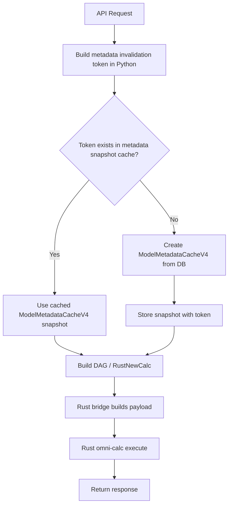

# Issue 1: Safe Invalidation Token for Cross-Request Cache Reuse

Date: 2026-05-07

## Validation Summary

This issue is valid and required before adding any cross-request cache for omni-calc metadata, plan snapshots, or calculation results.

The current code mainly uses the Rust calculation engine, but the metadata cache is created in Python before the Rust engine is called. Therefore, the invalidation token must also be created in the outer Python service layer before DAG planning and before Rust omni-calc execution.

The fix should not be implemented inside Rust formula evaluation, Rust resolver logic, Rust preload execution, or Rust calculation-step execution.

Correct placement:

```text
API request
  -> build safe Python invalidation token
  -> get/rebuild outer Python metadata snapshot cache
  -> build Python DAG/controller
  -> call Rust bridge
  -> call Rust omni-calc
```

## Current Code Validation

### Rust model data values path

File:

```text
modelAPI/resources/model_data_values_rust.py
```

Current flow:

```python
shared_pool = get_shared_pool(max_pool=8)
metadata_cache = ModelMetadataCacheV4(
    model_id=model_id, scenario_id=scenario.id, shared_pool=shared_pool
)

c = RustNewCalc(all_block_ids, scenario.id, metadata_cache=metadata_cache)
calc_result = rust_bridge.calculate_from_controller(c, metadata_cache)
```

This confirms metadata is loaded before the Rust engine is called.

### Rust block KPI path

File:

```text
modelAPI/resources/block_kpi_v4_rust.py
```

Current flow:

```python
shared_pool = get_shared_pool(max_pool=8)
with trace_section("cache_init"):
    metadata_cache = ModelMetadataCacheV4(
        model_id=model_id,
        scenario_id=scenario_id,
        shared_pool=shared_pool,
    )

c = NewCalc([block_id], scenario_id, metadata_cache=metadata_cache)
calc_result = rust_bridge.calculate_from_controller(c, metadata_cache)
```

This also confirms the cache layer is outside Rust.

### Rust bridge path

File:

```text
modelAPI/calc_engine/rust_bridge.py
```

Current flow:

```python
payload = self._build_payload(calc_controller, metadata_cache)
plan = _omni_calc.PyCalcPlan.from_dict(payload)
result = _omni_calc.execute(plan, metadata_cache)
```

The Rust engine receives the already-created Python metadata cache.

### Metadata cache path

File:

```text
modelAPI/services/model_metadata_cache_v4.py
```

Current flow:

```python
class ModelMetadataCacheV4:
    def __init__(self, model_id: int, scenario_id: int, pool_size: int = 4, shared_pool=None):
        self.model_id = int(model_id)
        self.scenario_id = int(scenario_id)
        self.pool_size = pool_size
        self.shared_pool = shared_pool
        self._load_all_metadata()
```

`_load_all_metadata()` runs the full metadata query set on every cache construction:

```python
runner = ParallelJSONRunner(pool_size=self.pool_size, shared_pool=self.shared_pool)
queries = self._build_queries()
results = runner.run(queries)
self._process_results(results)
```

### Tables currently loaded by `ModelMetadataCacheV4`

`ModelMetadataCacheV4._build_queries()` currently loads:

- `Models`
- `Blocks`
- `BlockDimensions`
- `Dimensions`
- `DimensionProperties`
- `Indicators`
- `DimItemScenarios`
- `DimensionItems`
- `DimItemProperties`
- `ModelScenarios`
- `DataInputs`

Query 8 intentionally loads `DimItemProperties` for all scenarios of the model:

```sql
WHERE d.model_id = $1
```

That means the invalidation token must include all-scenario item property state, not only the active scenario.

## Schema Field Validation

Current model definitions confirm:

| Table | Useful timestamp/revision field in code | Notes |
|---|---|---|
| `Models` | `last_modified_at` | Exists. |
| `ModelScenarios` | `last_modified_at` | Exists. |
| `Blocks` | `last_modified_at` | Exists. Indicator and data input updates often update block timestamp. |
| `Indicators` | `date_created` only | No direct `last_modified_at`. Must fingerprint relevant columns. |
| `Dimensions` | `date_created` only | No direct `last_modified_at`. Must fingerprint relevant columns. |
| `DimensionItems` | none visible in model definition | Must fingerprint relevant columns. |
| `DimensionProperties` | none visible in model definition | Must fingerprint relevant columns. |
| `DimItemProperties` | none visible in model definition | Must fingerprint relevant columns. |
| `DimItemScenarios` | `item_creation_date` only | Not a full revision field. Must fingerprint relevant columns. |
| `DataInputs` | `date_created` only | No direct update timestamp. Must fingerprint relevant columns. |

Root cause is confirmed: a cache key based only on `(model_id, scenario_id)` is unsafe because many tables can change without a simple revision field.

## Root Cause

There is no deterministic invalidation token for the Python metadata snapshot used by Rust omni-calc.

Without this token:

- cross-request metadata cache can serve stale data,
- plan cache can reuse an old DAG,
- result cache can return outdated calculation output,
- cache keys like `(model_id, scenario_id)` are not enough.

## Manager-Friendly Explanation

We want to cache model metadata so repeated calculations are faster. But before we cache it, we need a safe way to know whether the model data has changed.

Some tables have a clear "last updated" timestamp, but many important tables do not. So we need to build a "fingerprint" of the metadata. If anything important changes, the fingerprint changes, and the cache automatically refreshes.

This is a safety prerequisite. It prevents the app from showing stale numbers after users edit dimensions, indicators, inputs, or properties.

## Developer Explanation

This issue should add a deterministic invalidation token builder in Python.

The token belongs in the outer Python layer because `ModelMetadataCacheV4` is created before:

- `RustNewCalc(...)`
- `rust_bridge.calculate_from_controller(...)`
- `_omni_calc.execute(...)`

The token must cover all tables used to build `ModelMetadataCacheV4`, including all-scenario `DimItemProperties`, because the current metadata query loads all item properties for the model.

For metadata snapshot caching:

```text
cache key = (model_id, scenario_id, metadata_invalidation_token)
```

For future plan/result caching:

```text
cache key = (model_id, scenario_id, metadata_invalidation_token, request_shape_hash)
```

## Suggested Flow Diagram



## Implementation Approach

Add an invalidation-token module first. Do not add cross-request cache reuse until this token exists and is tested.

### File to add

```text
modelAPI/services/model_metadata_invalidation_v4.py
```

### Complete code to add

```python
import hashlib
import json
from dataclasses import dataclass
from typing import Any, Dict, Iterable, Optional

from services.db_engine.parallel_dataframe_queries import ParallelJSONRunner


TOKEN_VERSION = "omni-calc-metadata-v1"


@dataclass(frozen=True)
class MetadataInvalidationIdentity:
    model_id: int
    scenario_id: int
    token: str


def _stable_json(value: Any) -> str:
    return json.dumps(value, sort_keys=True, separators=(",", ":"), default=str)


def _sha256(value: Any) -> str:
    return hashlib.sha256(_stable_json(value).encode("utf-8")).hexdigest()


def _first_payload(results: Iterable[Any]) -> Dict[str, Any]:
    result_list = list(results)
    if not result_list or not result_list[0]:
        raise ValueError("Metadata invalidation token query returned no rows")

    row = result_list[0][0]
    payload = row.get("token_payload")
    if payload is None:
        raise ValueError("Metadata invalidation token query did not return token_payload")

    if isinstance(payload, str):
        return json.loads(payload)

    return payload


def build_metadata_invalidation_identity(
    model_id: int,
    scenario_id: int,
    shared_pool=None,
) -> MetadataInvalidationIdentity:
    token = build_metadata_invalidation_token(
        model_id=model_id,
        scenario_id=scenario_id,
        shared_pool=shared_pool,
    )
    return MetadataInvalidationIdentity(
        model_id=int(model_id),
        scenario_id=int(scenario_id),
        token=token,
    )


def build_metadata_invalidation_token(
    model_id: int,
    scenario_id: int,
    shared_pool=None,
) -> str:
    payload = build_metadata_invalidation_payload(
        model_id=model_id,
        scenario_id=scenario_id,
        shared_pool=shared_pool,
    )
    return _sha256(payload)


def build_request_shape_hash(request_shape: Optional[Dict[str, Any]]) -> str:
    if not request_shape:
        return _sha256({"request_shape": None})
    return _sha256({"request_shape": request_shape})


def build_metadata_invalidation_payload(
    model_id: int,
    scenario_id: int,
    shared_pool=None,
) -> Dict[str, Any]:
    runner = ParallelJSONRunner(pool_size=1, shared_pool=shared_pool)
    results = runner.run([(_METADATA_INVALIDATION_SQL, (int(model_id), int(scenario_id)))])
    payload = _first_payload(results)
    payload["token_version"] = TOKEN_VERSION
    return payload


_METADATA_INVALIDATION_SQL = """
SELECT jsonb_build_object(
    'model', (
        SELECT jsonb_build_object(
            'id', m.id,
            'last_modified_at', m.last_modified_at::text,
            'time_granularity', m.time_granularity,
            'calendar_type', m.calendar_type,
            'plan_duration_periods', m.plan_duration_periods,
            'starting_period', m.starting_period::text,
            'fy_start_month', m.fy_start_month
        )
        FROM "Models" m
        WHERE m.id = $1
    ),
    'scenario', (
        SELECT jsonb_build_object(
            'id', ms.id,
            'ref_model', ms.ref_model,
            'last_modified_at', ms.last_modified_at::text,
            'start_date', ms.start_date::text,
            'is_base', ms.is_base
        )
        FROM "ModelScenarios" ms
        WHERE ms.id = $2 AND ms.ref_model = $1
    ),
    'blocks', (
        SELECT jsonb_build_object(
            'count', COUNT(*),
            'max_last_modified_at', MAX(b.last_modified_at)::text,
            'fingerprint', md5(COALESCE(string_agg(
                b.id::text || ':' ||
                COALESCE(b.name, '') || ':' ||
                COALESCE(b.position::text, '') || ':' ||
                COALESCE(b.description, '') || ':' ||
                COALESCE(b.favourite::text, '') || ':' ||
                COALESCE(b.model_category_id::text, ''),
                '|' ORDER BY b.id
            ), ''))
        )
        FROM "Blocks" b
        WHERE b.model_id = $1
    ),
    'block_dimensions', (
        SELECT jsonb_build_object(
            'count', COUNT(*),
            'fingerprint', md5(COALESCE(string_agg(
                bd.block_id::text || ':' || bd.dimension_id::text,
                '|' ORDER BY bd.block_id, bd.dimension_id
            ), ''))
        )
        FROM "BlockDimensions" bd
        JOIN "Blocks" b ON b.id = bd.block_id
        WHERE b.model_id = $1
    ),
    'dimensions', (
        SELECT jsonb_build_object(
            'count', COUNT(*),
            'fingerprint', md5(COALESCE(string_agg(
                d.id::text || ':' ||
                COALESCE(d.name, '') || ':' ||
                COALESCE(d.position::text, '') || ':' ||
                COALESCE(d.enable_start_end::text, '') || ':' ||
                COALESCE(d.driver_page::text, '') || ':' ||
                COALESCE(d.group_property_id::text, ''),
                '|' ORDER BY d.id
            ), ''))
        )
        FROM "Dimensions" d
        WHERE d.model_id = $1
    ),
    'dimension_properties', (
        SELECT jsonb_build_object(
            'count', COUNT(*),
            'fingerprint', md5(COALESCE(string_agg(
                dp.id::text || ':' ||
                dp.dimension_id::text || ':' ||
                COALESCE(dp.name, '') || ':' ||
                COALESCE(dp.type, '') || ':' ||
                COALESCE(dp.data_format, '') || ':' ||
                COALESCE(dp.dim_driver::text, '') || ':' ||
                COALESCE(dp.default_value, '') || ':' ||
                COALESCE(dp.position::text, ''),
                '|' ORDER BY dp.id
            ), ''))
        )
        FROM "DimensionProperties" dp
        JOIN "Dimensions" d ON d.id = dp.dimension_id
        WHERE d.model_id = $1
    ),
    'indicators', (
        SELECT jsonb_build_object(
            'count', COUNT(*),
            'fingerprint', md5(COALESCE(string_agg(
                i.id::text || ':' ||
                i.block_id::text || ':' ||
                COALESCE(i.name, '') || ':' ||
                COALESCE(i.type, '') || ':' ||
                COALESCE(i.formula, '') || ':' ||
                COALESCE(i.parsed_formula, '') || ':' ||
                COALESCE(i.variables::text, '') || ':' ||
                COALESCE(i.methods::text, '') || ':' ||
                COALESCE(i.data_type, '') || ':' ||
                COALESCE(i.data_format, '') || ':' ||
                COALESCE(i.data_format_properties::text, '') || ':' ||
                COALESCE(i.position::text, '') || ':' ||
                COALESCE(i.output_ind_id::text, '') || ':' ||
                COALESCE(i.actual_data_values::text, ''),
                '|' ORDER BY i.id
            ), ''))
        )
        FROM "Indicators" i
        JOIN "Blocks" b ON b.id = i.block_id
        WHERE b.model_id = $1
    ),
    'dimension_items_for_scenario', (
        SELECT jsonb_build_object(
            'count', COUNT(*),
            'fingerprint', md5(COALESCE(string_agg(
                dis.id::text || ':' ||
                dis.dimension_id::text || ':' ||
                dis.item_id::text || ':' ||
                COALESCE(dis.position::text, '') || ':' ||
                COALESCE(dis.item_creation_date::text, '') || ':' ||
                COALESCE(di.name, '') || ':' ||
                COALESCE(di.position::text, ''),
                '|' ORDER BY dis.dimension_id, dis.position, dis.item_id, dis.id
            ), ''))
        )
        FROM "DimItemScenarios" dis
        JOIN "DimensionItems" di ON di.id = dis.item_id
        JOIN "Dimensions" d ON d.id = dis.dimension_id
        WHERE d.model_id = $1 AND dis.scenario_id = $2
    ),
    'item_properties_all_model_scenarios', (
        SELECT jsonb_build_object(
            'count', COUNT(*),
            'fingerprint', md5(COALESCE(string_agg(
                ip.item_id::text || ':' ||
                ip.property_id::text || ':' ||
                ip.scenario_id::text || ':' ||
                COALESCE(ip.value, ''),
                '|' ORDER BY ip.item_id, ip.property_id, ip.scenario_id
            ), ''))
        )
        FROM "DimItemProperties" ip
        JOIN "DimensionItems" di ON di.id = ip.item_id
        JOIN "Dimensions" d ON d.id = di.dimension_id
        WHERE d.model_id = $1
    ),
    'data_inputs_for_scenario', (
        SELECT jsonb_build_object(
            'count', COUNT(*),
            'fingerprint', md5(COALESCE(string_agg(
                di.id::text || ':' ||
                di.indicator_id::text || ':' ||
                COALESCE(di.type, '') || ':' ||
                COALESCE(di.dimensions, '') || ':' ||
                COALESCE(di.data_values, '') || ':' ||
                COALESCE(di.date_created::text, '') || ':' ||
                COALESCE(di.input_adjustment::text, ''),
                '|' ORDER BY di.indicator_id, di.id
            ), ''))
        )
        FROM "DataInputs" di
        JOIN "Indicators" i ON i.id = di.indicator_id
        JOIN "Blocks" b ON b.id = i.block_id
        WHERE b.model_id = $1 AND di.scenario_id = $2
    )
) AS token_payload
"""
```

### Why this exact approach

- It uses real tables and fields currently used by `ModelMetadataCacheV4`.
- It is built outside the Rust engine.
- It is deterministic because each fingerprint uses explicit `ORDER BY`.
- It includes all-scenario `DimItemProperties` because current Query 8 loads all model scenarios.
- It separates metadata invalidation from request-shape hashing.
- It can be used by future metadata snapshot, plan, and result caches.

### File to update later when outer cache is implemented

```text
modelAPI/services/model_metadata_cache_factory_v4.py
```

The future outer metadata cache should use the token like this:

```python
from services.model_metadata_invalidation_v4 import build_metadata_invalidation_identity


identity = build_metadata_invalidation_identity(
    model_id=model_id,
    scenario_id=scenario_id,
    shared_pool=shared_pool,
)

cache_key = (identity.model_id, identity.scenario_id, identity.token)
```

### Do not use this unsafe key

```python
cache_key = (model_id, scenario_id)
```

This is unsafe because dimension items, properties, inputs, formulas, and all-scenario item properties can change without changing only those two IDs.

### Future plan/result cache key shape

When caching calc plans or results later, include request shape:

```python
from services.model_metadata_invalidation_v4 import (
    build_metadata_invalidation_identity,
    build_request_shape_hash,
)


identity = build_metadata_invalidation_identity(
    model_id=model_id,
    scenario_id=scenario_id,
    shared_pool=shared_pool,
)

request_shape_hash = build_request_shape_hash({
    "block_ids": sorted(all_block_ids),
    "requested_indicator_ids": sorted(requested_indicator_ids),
    "time_start_value": starting_period,
    "time_end_value": ending_period,
    "query_params": query_params,
    "filters": filter_list,
    "actuals_mode": actuals_mode,
    "forecast_start_date": forecast_start_date,
})

plan_or_result_cache_key = (
    identity.model_id,
    identity.scenario_id,
    identity.token,
    request_shape_hash,
)
```

For this issue, only the metadata invalidation token is required. The request-shape hash exists so later plan/result cache work does not misuse the metadata-only token.

## Tests to Add

### Unit test file

Add:

```text
modelAPI/tests/test_model_metadata_invalidation_v4.py
```

### Unit test code shape

```python
from unittest.mock import patch

from services.model_metadata_invalidation_v4 import (
    build_metadata_invalidation_token,
    build_request_shape_hash,
)


def _mock_runner(payload):
    class _Runner:
        def __init__(self, *args, **kwargs):
            pass

        def run(self, queries):
            return [[{"token_payload": payload}]]

    return _Runner


def test_metadata_token_is_stable_for_same_payload():
    payload = {
        "model": {"id": 1, "last_modified_at": "2026-05-07T00:00:00"},
        "blocks": {"count": 1, "fingerprint": "a"},
    }

    with patch(
        "services.model_metadata_invalidation_v4.ParallelJSONRunner",
        _mock_runner(payload),
    ):
        first = build_metadata_invalidation_token(1, 2)
        second = build_metadata_invalidation_token(1, 2)

    assert first == second


def test_metadata_token_changes_when_payload_changes():
    payload_a = {
        "model": {"id": 1, "last_modified_at": "2026-05-07T00:00:00"},
        "blocks": {"count": 1, "fingerprint": "a"},
    }
    payload_b = {
        "model": {"id": 1, "last_modified_at": "2026-05-07T00:00:00"},
        "blocks": {"count": 2, "fingerprint": "b"},
    }

    with patch(
        "services.model_metadata_invalidation_v4.ParallelJSONRunner",
        _mock_runner(payload_a),
    ):
        first = build_metadata_invalidation_token(1, 2)

    with patch(
        "services.model_metadata_invalidation_v4.ParallelJSONRunner",
        _mock_runner(payload_b),
    ):
        second = build_metadata_invalidation_token(1, 2)

    assert first != second


def test_request_shape_hash_is_stable_for_key_order_changes():
    first = build_request_shape_hash({
        "block_ids": [2, 1],
        "time_start_value": "Jan-25",
    })
    second = build_request_shape_hash({
        "time_start_value": "Jan-25",
        "block_ids": [2, 1],
    })

    assert first == second


def test_request_shape_hash_changes_for_different_filters():
    first = build_request_shape_hash({"filters": [{"dimension": 1, "value": "A"}]})
    second = build_request_shape_hash({"filters": [{"dimension": 1, "value": "B"}]})

    assert first != second
```

### Mutation test matrix

Add integration-style tests or manual QA cases proving token changes for:

| Mutation | Expected token behavior |
|---|---|
| Model calendar/time settings changed | Token changes |
| Scenario `start_date` changed | Token changes |
| Block added/removed/renamed/reordered | Token changes |
| Block-dimension mapping changed | Token changes |
| Dimension added/removed/renamed/reordered | Token changes |
| Dimension `group_property_id` changed | Token changes |
| Dimension property added/removed/changed | Token changes |
| Indicator formula changed | Token changes |
| Indicator position/name/type changed | Token changes |
| Dimension item added/removed/renamed/reordered for active scenario | Token changes |
| Item property value changed in any scenario for the model | Token changes |
| Data input value changed for active scenario | Token changes |
| Unrelated model changed | Token does not change |
| Unrelated scenario item ordering changed | Token should not change unless all-scenario behavior requires it |

## Edge Cases and Risks

### Token query cost

The SQL fingerprints can scan large metadata tables. This is acceptable for the first safe design because correctness matters before cache speed. If token cost becomes high, add table revision columns later.

### Stale cache risk

If any table affecting calculation output is missed, future caches may serve stale metadata or results.

Mitigation:

- token must cover all `ModelMetadataCacheV4` query inputs,
- mutation tests must prove expected token changes,
- future cache should remain disabled by default until parity is proven.

### All-scenario item property loading

Current `ModelMetadataCacheV4` loads all `DimItemProperties` for the model. The token must include all scenarios for item properties. If a later ticket narrows property loading to active scenario only, this token can be narrowed in the same change.

### Request shape confusion

The metadata token is enough for metadata snapshot cache. It is not enough for plan or result cache. Plan/result caches must also include request shape.

### Multi-process deployment

This token is safe for in-process cache and Redis cache. The token itself is deterministic and does not depend on process memory.

## Jira Issue Draft

### Summary

Define safe metadata invalidation token for cross-request omni-calc cache reuse

### Issue Type

Performance / Technical Foundation

### Problem Description

`ModelMetadataCacheV4` loads model metadata for every request before Rust omni-calc execution. To safely reuse metadata snapshots across requests, we need a deterministic invalidation token that changes whenever relevant model metadata, dimensions, properties, indicators, scenario items, or data inputs change.

Without this token, cross-request cache keys like `(model_id, scenario_id)` are unsafe and can serve stale calculation metadata.

### Root Cause

The current metadata cache is request-local and has no safe cross-request invalidation identity. Some high-level tables have `last_modified_at`, but many metadata-heavy tables do not. Therefore, cache invalidation must use deterministic fingerprints for tables without direct revision fields.

### Actual Behavior

Each request creates `ModelMetadataCacheV4`, runs metadata queries, processes the result, builds the calc controller, and then calls Rust omni-calc. No reusable invalidation token exists.

### Expected Behavior

Python can build a deterministic metadata invalidation token before calculation. Future cache layers can safely use this token as part of their cache key. If any relevant metadata changes, the token changes.

### Proposed Fix

Add `modelAPI/services/model_metadata_invalidation_v4.py` with:

- `build_metadata_invalidation_payload(...)`
- `build_metadata_invalidation_token(...)`
- `build_metadata_invalidation_identity(...)`
- `build_request_shape_hash(...)`

Use SQL fingerprints based on real fields and tables currently used by `ModelMetadataCacheV4`.

Do not implement this inside Rust. This belongs in the outer Python service layer before the calc controller and Rust bridge are called.

### Acceptance Criteria

- Token builder exists in Python service layer.
- Token covers all current `ModelMetadataCacheV4` metadata sources.
- Token includes all-scenario `DimItemProperties` because current metadata cache loads all scenarios for item properties.
- Token is deterministic for unchanged metadata.
- Token changes when relevant metadata changes.
- Token does not change when unrelated model metadata changes.
- Unit tests cover deterministic hashing and request-shape hashing.
- Mutation test matrix is documented and executed before using the token for production cache reuse.
- Future metadata cache can safely key by `(model_id, scenario_id, token)`.

### Testing Notes

Run unit tests:

```bash
cd /Users/veerpratapsingh/Desktop/blox/Blox-Dev/modelAPI
.venv/bin/python -m pytest tests/test_model_metadata_invalidation_v4.py -q
```

Manual validation:

1. Build token for a model/scenario.
2. Build token again without changes.
3. Confirm both tokens match.
4. Change an indicator formula.
5. Build token again.
6. Confirm token changes.
7. Revert or use another model.
8. Change unrelated model metadata.
9. Confirm original model/scenario token does not change.

## Recommended Implementation Order

1. Add `model_metadata_invalidation_v4.py`.
2. Add unit tests with mocked query payloads.
3. Add DB-backed mutation tests or manual mutation verification.
4. Add documentation showing metadata cache key shape.
5. Only after this issue is accepted, implement outer metadata snapshot cache using this token.

## Out of Scope

- Do not add metadata snapshot cache in this issue.
- Do not add result cache in this issue.
- Do not add plan cache in this issue.
- Do not modify Rust calculation behavior.
- Do not add Redis cache yet.
- Do not narrow all-scenario property loading yet.

