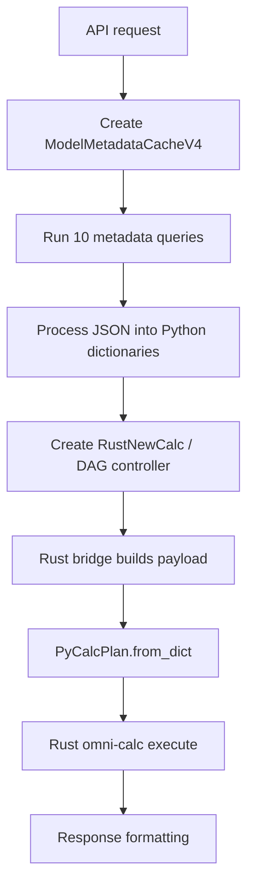
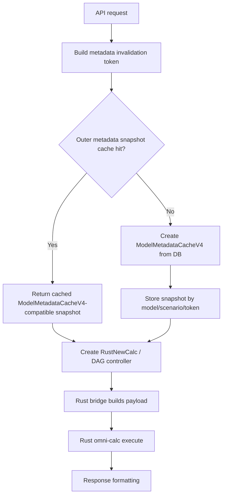

# Outer Python Metadata Snapshot Cache Before Omni-Calc Engine

Date: 2026-05-07

## Assumption

The detailed issue description in the prompt was a placeholder. Based on the surrounding requirement, this analysis treats the issue as:

> Add a safe outer Python metadata cache before calling the omni-calc calculation engine, especially the Rust calculation engine, so repeated requests do not rebuild the same `ModelMetadataCacheV4` snapshot again and again.

This cache must live outside the Rust/Python calculation engine execution path. It should be created in the Python service layer before DAG planning and before Rust omni-calc execution.

---

## Validation Result

This issue is real and performance-relevant.

The current request flow creates `ModelMetadataCacheV4` per request. Creating that object immediately runs metadata queries and processes the result into Python dictionaries. That happens before the Rust omni-calc engine is called.

Current code confirms this:

- `modelAPI/resources/model_data_values_rust.py`
  - creates `ModelMetadataCacheV4(...)`
  - creates `RustNewCalc(...)`
  - calls `rust_bridge.calculate_from_controller(...)`

- `modelAPI/resources/block_kpi_v4_rust.py`
  - creates `ModelMetadataCacheV4(...)`
  - creates `NewCalc(...)`
  - calls `rust_bridge.calculate_from_controller(...)`

- `modelAPI/calc_engine/rust_bridge.py`
  - builds payload from the controller and metadata cache
  - creates `PyCalcPlan`
  - calls `_omni_calc.execute(plan, metadata_cache)`

- `modelAPI/services/model_metadata_cache_v4.py`
  - `ModelMetadataCacheV4.__init__` calls `_load_all_metadata()`
  - `_load_all_metadata()` builds and runs 10 metadata queries
  - `_process_results()` stores results in Python dictionaries

So the correct cache layer is outside omni-calc execution:

```text
API request
  -> build/get Python metadata snapshot cache
  -> build DAG / calc controller
  -> build Rust payload
  -> call Rust omni-calc
  -> format response
```

The cache should not be implemented inside Rust formula execution, resolver execution, or calculation-step processing.

---

## Current Flow



Problem: repeated requests for the same model/scenario rebuild the metadata cache from DB every time.

---

## Target Flow



The Rust engine receives the same metadata-cache interface. Only the way the Python metadata cache is created changes.

---

## Root Cause

The current metadata cache is request-local only.

`ModelMetadataCacheV4` avoids repeated DB calls inside one request, but it does not reuse metadata across requests. If two requests ask for the same model/scenario and metadata has not changed, both requests still:

- create a new `ModelMetadataCacheV4`
- run the same metadata queries
- parse/process the same JSON
- rebuild the same Python dictionaries

This creates avoidable request setup time before actual Rust calculation starts.

---

## Files and Functions Involved

### Metadata Cache

`modelAPI/services/model_metadata_cache_v4.py`

Important functions:

- `ModelMetadataCacheV4.__init__`
- `_load_all_metadata`
- `_build_queries`
- `_process_results`
- `get_block_indicators`
- `get_dimension_properties`
- `get_dimension_items`
- `get_item_property_values_bulk`
- `find_dimension_property_by_id`
- `find_items_by_property_id_value`

### Rust Model Data Values Flow

`modelAPI/resources/model_data_values_rust.py`

Current important code shape:

```python
metadata_cache = ModelMetadataCacheV4(
    model_id=model_id,
    scenario_id=scenario.id,
    shared_pool=shared_pool,
)

c = RustNewCalc(all_block_ids, scenario.id, metadata_cache=metadata_cache)
calc_result = rust_bridge.calculate_from_controller(c, metadata_cache)
```

### Rust Block KPI Flow

`modelAPI/resources/block_kpi_v4_rust.py`

Current important code shape:

```python
metadata_cache = ModelMetadataCacheV4(
    model_id=model_id,
    scenario_id=scenario_id,
    shared_pool=shared_pool,
)

c = NewCalc([block_id], scenario_id, metadata_cache=metadata_cache)
calc_result = rust_bridge.calculate_from_controller(c, metadata_cache)
```

### Rust Bridge

`modelAPI/calc_engine/rust_bridge.py`

Current important code shape:

```python
payload = self._build_payload(calc_controller, metadata_cache)
plan = _omni_calc.PyCalcPlan.from_dict(payload)
result = _omni_calc.execute(plan, metadata_cache)
```

The cache should be applied before this bridge call, not inside `_omni_calc.execute`.

---

## Recommended Implementation Approach

Add a dedicated outer Python metadata cache factory.

Do not replace the existing Flask response cache. Response caching and metadata snapshot caching solve different problems:

- Flask response cache stores endpoint responses.
- The new metadata snapshot cache stores reusable model/scenario metadata used before calculation.

### Step 1: Add a New Cache Factory Module

Create:

```text
modelAPI/services/model_metadata_cache_factory_v4.py
```

Recommended responsibilities:

- read feature flags
- build a safe invalidation token
- return a `ModelMetadataCacheV4` compatible object
- cache snapshots by `(model_id, scenario_id, token)`
- track hit/miss/eviction counters
- keep cache bounded

Code shape:

```python
import copy
import os
import threading
import time
from collections import OrderedDict
from dataclasses import dataclass
from typing import Any, Dict, Optional, Tuple

from services.db_engine.parallel_dataframe_queries import ParallelJSONRunner
from services.model_metadata_cache_v4 import ModelMetadataCacheV4


@dataclass(frozen=True)
class MetadataCacheKey:
    model_id: int
    scenario_id: int
    token: str


@dataclass
class MetadataCacheEntry:
    snapshot: Dict[str, Any]
    created_at: float
    last_accessed_at: float
    hit_count: int = 0


_LOCK = threading.RLock()
_CACHE: "OrderedDict[MetadataCacheKey, MetadataCacheEntry]" = OrderedDict()


def _is_enabled() -> bool:
    return os.environ.get("OMNI_CALC_METADATA_CACHE_ENABLED", "0").lower() in {"1", "true", "yes"}


def _max_entries() -> int:
    return int(os.environ.get("OMNI_CALC_METADATA_CACHE_MAX_ENTRIES", "32"))


def _ttl_seconds() -> int:
    return int(os.environ.get("OMNI_CALC_METADATA_CACHE_TTL_SECONDS", "300"))


def get_model_metadata_cache_v4(model_id: int, scenario_id: int, shared_pool=None) -> ModelMetadataCacheV4:
    if not _is_enabled():
        return ModelMetadataCacheV4(model_id=model_id, scenario_id=scenario_id, shared_pool=shared_pool)

    token = build_metadata_invalidation_token(model_id, scenario_id, shared_pool=shared_pool)
    key = MetadataCacheKey(int(model_id), int(scenario_id), token)
    now = time.time()

    with _LOCK:
        entry = _CACHE.get(key)
        if entry and now - entry.created_at <= _ttl_seconds():
            entry.last_accessed_at = now
            entry.hit_count += 1
            _CACHE.move_to_end(key)
            return ModelMetadataCacheV4.from_snapshot(copy.deepcopy(entry.snapshot))

    fresh_cache = ModelMetadataCacheV4(model_id=model_id, scenario_id=scenario_id, shared_pool=shared_pool)
    snapshot = fresh_cache.to_snapshot()

    with _LOCK:
        _CACHE[key] = MetadataCacheEntry(
            snapshot=copy.deepcopy(snapshot),
            created_at=now,
            last_accessed_at=now,
        )
        _CACHE.move_to_end(key)
        while len(_CACHE) > _max_entries():
            _CACHE.popitem(last=False)

    return fresh_cache
```

Why return a copy from cached data:

- Existing code treats metadata dictionaries as normal Python structures.
- Some code reads private fields like `_item_properties_cache`.
- Returning a request-local wrapper avoids accidental mutation leaking across requests.

Later optimization can replace deep-copy with immutable snapshot objects if copy cost is too high.

### Step 2: Add Snapshot Methods to `ModelMetadataCacheV4`

Update:

```text
modelAPI/services/model_metadata_cache_v4.py
```

Add:

```python
def to_snapshot(self) -> Dict[str, Any]:
    return {
        "model_id": self.model_id,
        "scenario_id": self.scenario_id,
        "pool_size": self.pool_size,
        "_model_data": self._model_data,
        "_blocks_cache": self._blocks_cache,
        "_dimensions_cache": self._dimensions_cache,
        "_indicators_cache": self._indicators_cache,
        "_dim_item_map": self._dim_item_map,
        "_block_dimensions_map": self._block_dimensions_map,
        "_dimension_properties_cache": self._dimension_properties_cache,
        "_item_properties_cache": self._item_properties_cache,
        "_item_id_to_dim_item_map": self._item_id_to_dim_item_map,
        "_item_scenario_map": self._item_scenario_map,
        "_scenario_cache": self._scenario_cache,
        "_data_inputs_cache": self._data_inputs_cache,
    }


@classmethod
def from_snapshot(cls, snapshot: Dict[str, Any]) -> "ModelMetadataCacheV4":
    obj = cls.__new__(cls)
    obj.model_id = int(snapshot["model_id"])
    obj.scenario_id = int(snapshot["scenario_id"])
    obj.pool_size = int(snapshot.get("pool_size", 4))
    obj.shared_pool = None
    obj._model_data = snapshot["_model_data"]
    obj._blocks_cache = snapshot["_blocks_cache"]
    obj._dimensions_cache = snapshot["_dimensions_cache"]
    obj._indicators_cache = snapshot["_indicators_cache"]
    obj._dim_item_map = snapshot["_dim_item_map"]
    obj._block_dimensions_map = snapshot["_block_dimensions_map"]
    obj._dimension_properties_cache = snapshot["_dimension_properties_cache"]
    obj._item_properties_cache = snapshot["_item_properties_cache"]
    obj._item_id_to_dim_item_map = snapshot["_item_id_to_dim_item_map"]
    obj._item_scenario_map = snapshot["_item_scenario_map"]
    obj._scenario_cache = snapshot["_scenario_cache"]
    obj._data_inputs_cache = snapshot["_data_inputs_cache"]
    return obj
```

This keeps all existing callers working because the object still exposes the same methods.

### Step 3: Add a Safe Invalidation Token

Add this function in:

```text
modelAPI/services/model_metadata_cache_factory_v4.py
```

Code shape:

```python
import hashlib
import json


def build_metadata_invalidation_token(model_id: int, scenario_id: int, shared_pool=None) -> str:
    runner = ParallelJSONRunner(pool_size=2, shared_pool=shared_pool)
    query = """
    SELECT jsonb_build_object(
        'model_id', $1,
        'scenario_id', $2,
        'scenario_last_modified_at', (
            SELECT ms.last_modified_at::text
            FROM "ModelScenarios" ms
            WHERE ms.id = $2
        ),
        'blocks', (
            SELECT jsonb_build_object(
                'count', COUNT(*),
                'fingerprint', md5(COALESCE(string_agg(
                    b.id::text || ':' || COALESCE(b.name, '') || ':' || COALESCE(b.position::text, ''),
                    '|' ORDER BY b.id
                ), ''))
            )
            FROM "Blocks" b
            WHERE b.model_id = $1
        ),
        'block_dimensions', (
            SELECT jsonb_build_object(
                'count', COUNT(*),
                'fingerprint', md5(COALESCE(string_agg(
                    bd.block_id::text || ':' || bd.dimension_id::text,
                    '|' ORDER BY bd.block_id, bd.dimension_id
                ), ''))
            )
            FROM "BlockDimensions" bd
            JOIN "Blocks" b ON b.id = bd.block_id
            WHERE b.model_id = $1
        ),
        'dimensions', (
            SELECT jsonb_build_object(
                'count', COUNT(*),
                'fingerprint', md5(COALESCE(string_agg(
                    d.id::text || ':' || COALESCE(d.name, '') || ':' || COALESCE(d.position::text, '') || ':' ||
                    COALESCE(d.enable_start_end::text, '') || ':' || COALESCE(d.group_property_id::text, ''),
                    '|' ORDER BY d.id
                ), ''))
            )
            FROM "Dimensions" d
            WHERE d.model_id = $1
        ),
        'dimension_properties', (
            SELECT jsonb_build_object(
                'count', COUNT(*),
                'fingerprint', md5(COALESCE(string_agg(
                    dp.id::text || ':' || dp.dimension_id::text || ':' || COALESCE(dp.name, '') || ':' ||
                    COALESCE(dp.type, '') || ':' || COALESCE(dp.data_format::text, ''),
                    '|' ORDER BY dp.id
                ), ''))
            )
            FROM "DimensionProperties" dp
            JOIN "Dimensions" d ON d.id = dp.dimension_id
            WHERE d.model_id = $1
        ),
        'indicators', (
            SELECT jsonb_build_object(
                'count', COUNT(*),
                'fingerprint', md5(COALESCE(string_agg(
                    i.id::text || ':' || i.block_id::text || ':' || COALESCE(i.name, '') || ':' ||
                    COALESCE(i.type, '') || ':' || COALESCE(i.parsed_formula, '') || ':' ||
                    COALESCE(i.position::text, '') || ':' || COALESCE(i.actual_data_values::text, ''),
                    '|' ORDER BY i.id
                ), ''))
            )
            FROM "Indicators" i
            JOIN "Blocks" b ON b.id = i.block_id
            WHERE b.model_id = $1
        ),
        'dimension_items', (
            SELECT jsonb_build_object(
                'count', COUNT(*),
                'fingerprint', md5(COALESCE(string_agg(
                    dis.dimension_id::text || ':' || dis.item_id::text || ':' || COALESCE(dis.position::text, ''),
                    '|' ORDER BY dis.dimension_id, dis.position, dis.item_id
                ), ''))
            )
            FROM "DimItemScenarios" dis
            JOIN "Dimensions" d ON d.id = dis.dimension_id
            WHERE d.model_id = $1 AND dis.scenario_id = $2
        ),
        'item_properties', (
            SELECT jsonb_build_object(
                'count', COUNT(*),
                'fingerprint', md5(COALESCE(string_agg(
                    ip.item_id::text || ':' || ip.property_id::text || ':' || ip.scenario_id::text || ':' ||
                    COALESCE(ip.value::text, ''),
                    '|' ORDER BY ip.item_id, ip.property_id, ip.scenario_id
                ), ''))
            )
            FROM "DimItemProperties" ip
            JOIN "DimensionItems" di ON di.id = ip.item_id
            JOIN "Dimensions" d ON d.id = di.dimension_id
            WHERE d.model_id = $1
        ),
        'data_inputs', (
            SELECT jsonb_build_object(
                'count', COUNT(*),
                'fingerprint', md5(COALESCE(string_agg(
                    di.id::text || ':' || di.indicator_id::text || ':' || COALESCE(di.type, '') || ':' ||
                    COALESCE(di.data_values::text, '') || ':' || COALESCE(di.input_adjustment::text, ''),
                    '|' ORDER BY di.id
                ), ''))
            )
            FROM "DataInputs" di
            JOIN "Indicators" i ON i.id = di.indicator_id
            JOIN "Blocks" b ON b.id = i.block_id
            WHERE b.model_id = $1 AND di.scenario_id = $2
        )
    ) AS token
    """
    rows = runner.run([(query, (int(model_id), int(scenario_id)))])
    token_payload = rows[0][0]["token"]
    token_text = json.dumps(token_payload, sort_keys=True, default=str)
    return hashlib.sha256(token_text.encode("utf-8")).hexdigest()
```

Important note:

- This token query should be reviewed against the real production schema before implementation.
- If any referenced field is not available in production, replace that part with fields already used by `ModelMetadataCacheV4._build_queries`.
- The token must be correctness-first, even if it costs a small amount of setup time.

### Step 4: Replace Direct Constructors in Rust Endpoint Paths

Update:

```text
modelAPI/resources/model_data_values_rust.py
modelAPI/resources/block_kpi_v4_rust.py
```

Replace:

```python
from services.model_metadata_cache_v4 import ModelMetadataCacheV4
```

with:

```python
from services.model_metadata_cache_factory_v4 import get_model_metadata_cache_v4
```

Replace direct construction:

```python
metadata_cache = ModelMetadataCacheV4(
    model_id=model_id,
    scenario_id=scenario.id,
    shared_pool=shared_pool,
)
```

with:

```python
metadata_cache = get_model_metadata_cache_v4(
    model_id=model_id,
    scenario_id=scenario.id,
    shared_pool=shared_pool,
)
```

And for block KPI:

```python
metadata_cache = get_model_metadata_cache_v4(
    model_id=model_id,
    scenario_id=scenario_id,
    shared_pool=shared_pool,
)
```

This keeps the rest of the code unchanged.

### Step 5: Add Cache Metrics

Add helper functions in the factory module:

```python
_STATS = {
    "hits": 0,
    "misses": 0,
    "evictions": 0,
    "expired": 0,
}


def get_metadata_cache_stats() -> Dict[str, int]:
    with _LOCK:
        return dict(_STATS)


def clear_metadata_cache() -> None:
    with _LOCK:
        _CACHE.clear()
        for key in _STATS:
            _STATS[key] = 0
```

Use these for local debugging and tests.

### Step 6: Add Tests

Add tests under:

```text
modelAPI/tests/
```

Suggested test file:

```text
modelAPI/tests/test_model_metadata_cache_factory_v4.py
```

Test cases:

1. Cache disabled returns a fresh `ModelMetadataCacheV4`.
2. Cache enabled returns data from cache on second request.
3. Different scenario ID creates a different cache key.
4. Different invalidation token creates a miss.
5. TTL expiry creates a miss.
6. Max entries evicts oldest entry.
7. Mutating one returned request object does not mutate another cached response.
8. Rust endpoint code can use the returned object without changing the Rust bridge.

### Step 7: Add Runtime Safety Flags

Recommended environment flags:

```text
OMNI_CALC_METADATA_CACHE_ENABLED=0
OMNI_CALC_METADATA_CACHE_MAX_ENTRIES=32
OMNI_CALC_METADATA_CACHE_TTL_SECONDS=300
```

Default should be disabled until parity tests are complete.

---

## Edge Cases and Risks

### Stale Metadata

Risk:

The cache may return old metadata after a model/scenario/input/property change.

Mitigation:

- Use invalidation token.
- Keep cache disabled by default initially.
- Add parity tests.
- Add short TTL as secondary protection.

### Shared Mutable Data

Risk:

Existing code reads private dictionaries such as `_item_properties_cache`. If the same object is shared across requests and any caller mutates it, later requests can see incorrect data.

Mitigation:

- Return a request-local object using `from_snapshot(copy.deepcopy(snapshot))`.
- Later optimize with immutable snapshot structures only after proving no caller mutates metadata.

### Token Query Cost

Risk:

If the invalidation token query scans large metadata tables, it may reduce the benefit of caching.

Mitigation:

- Start with correctness.
- Measure token time separately.
- Later add real revision columns or cheaper mutation counters.

### Multi-Process Deployment

Risk:

In-process cache is per worker process. Multiple Gunicorn/process workers will not share entries.

Mitigation:

- Accept this for first phase.
- Add Redis only after correctness is proven.

### Memory Usage

Risk:

Large model metadata snapshots can consume memory.

Mitigation:

- Keep max entries low.
- Add TTL.
- Track approximate snapshot size later.
- Avoid unbounded cache.

### Actuals and Data Inputs

Risk:

Data inputs and actual values affect calculation output. The cache token must include them.

Mitigation:

- Include `DataInputs` in token.
- Include indicator `actual_data_values` in token.
- Add tests for actuals-heavy models.

---

## Manager-Friendly Explanation

Today, before Rust calculates a model, Python reloads and rebuilds all model metadata for each request. If the same model is opened or refreshed multiple times, we repeat the same setup work even when nothing changed.

The fix is to add a safe cache before the calculation engine starts. If the model metadata has not changed, Python can reuse the already-built metadata snapshot and then call the Rust engine as usual.

This does not change calculation logic. It only avoids repeated setup work before calculation.

Expected benefit:

- faster repeated model/dashboard requests
- lower DB load
- less Python setup time before Rust calculation

Main safety concern:

- the cache must never serve stale metadata after model changes, so we need an invalidation token and tests.

---

## Developer Explanation

This is not a Rust executor cache.

The Rust engine is already called from `rust_bridge.calculate_from_controller`. The metadata cache should be applied before creating `RustNewCalc` and before calling the Rust bridge.

The first implementation should preserve the existing `ModelMetadataCacheV4` interface:

```text
ModelMetadataCacheV4-compatible object in
same metadata accessors out
no Rust bridge changes required
```

Recommended architecture:

```text
resources/*.py
  -> get_model_metadata_cache_v4(...)
      -> disabled: ModelMetadataCacheV4(...)
      -> enabled:
          -> build token
          -> cache hit: ModelMetadataCacheV4.from_snapshot(...)
          -> cache miss: ModelMetadataCacheV4(...), store snapshot
  -> NewCalc(..., metadata_cache=metadata_cache)
  -> rust_bridge.calculate_from_controller(...)
```

This keeps the engine boundary clean and reduces regression risk.

---

## Jira Issue Draft

### Summary

Add safe outer Python metadata snapshot cache before Rust omni-calc execution

### Issue Type

Performance Improvement

### Problem Description

Rust omni-calc requests currently rebuild `ModelMetadataCacheV4` on every request. This metadata cache loads model blocks, dimensions, properties, dimension items, item properties, scenarios, indicators, and data inputs using parallel DB queries, then processes the results into Python dictionaries.

For repeated requests against the same model/scenario, this repeats setup work before the Rust calculation engine starts.

The cache should be implemented in the outer Python service layer before DAG planning and before the Rust omni-calc call.

### Root Cause

`ModelMetadataCacheV4` is request-local. Its constructor immediately calls `_load_all_metadata()`, and endpoint code directly constructs it for every request.

There is no process-level metadata snapshot cache keyed by model, scenario, and metadata invalidation token.

### Actual Behavior

Each request:

1. Creates `ModelMetadataCacheV4`.
2. Runs metadata DB queries.
3. Processes metadata JSON.
4. Builds DAG/controller.
5. Calls Rust omni-calc.

Repeated unchanged requests still redo steps 1-3.

### Expected Behavior

When metadata cache is enabled and model/scenario metadata has not changed:

1. API request builds/reads an invalidation token.
2. Python service layer reuses a cached metadata snapshot.
3. DAG/controller and Rust omni-calc receive the same metadata cache interface as before.
4. Calculation outputs remain unchanged.

When metadata changes, the token changes and the next request rebuilds the metadata snapshot.

### Proposed Fix

1. Add `modelAPI/services/model_metadata_cache_factory_v4.py`.
2. Add `get_model_metadata_cache_v4(model_id, scenario_id, shared_pool=None)`.
3. Add a metadata invalidation token based on model/scenario/block/dimension/property/indicator/data-input state.
4. Add bounded in-process cache with TTL and max entries.
5. Add `ModelMetadataCacheV4.to_snapshot()` and `ModelMetadataCacheV4.from_snapshot(...)`.
6. Replace direct `ModelMetadataCacheV4(...)` construction in Rust endpoint paths with the factory helper.
7. Keep the feature disabled by default until tests pass.

### Acceptance Criteria

- Metadata snapshot cache is implemented outside the Rust calculation engine.
- Rust bridge and Rust omni-calc execution logic do not need behavioral changes.
- Cache is opt-in through environment flag.
- Cache key includes model ID, scenario ID, and invalidation token.
- Cache has TTL and max-entry bounds.
- Repeated unchanged requests hit the cache.
- Metadata changes produce a cache miss.
- Returned metadata object remains compatible with existing `ModelMetadataCacheV4` callers.
- Calculation results match uncached behavior.
- Tests cover cache hit, miss, TTL expiry, scenario separation, invalidation-token change, and mutation isolation.

### Testing Notes

Run with cache disabled:

```bash
OMNI_CALC_METADATA_CACHE_ENABLED=0 python run.py
```

Run with cache enabled:

```bash
OMNI_CALC_METADATA_CACHE_ENABLED=1 \
OMNI_CALC_METADATA_CACHE_MAX_ENTRIES=32 \
OMNI_CALC_METADATA_CACHE_TTL_SECONDS=300 \
python run.py
```

Compare:

- response payload
- row count
- column count
- warning count
- selected indicator totals
- metadata cache init time
- Rust calculation time

Representative flows:

- model data values endpoint using Rust engine
- block KPI Rust endpoint
- repeated request for same model/scenario
- scenario change
- model metadata change
- data input change
- actuals-heavy model
- connected-dimension model

---

## Recommended First Implementation Scope

Keep the first PR small:

1. Add the cache factory.
2. Add snapshot methods.
3. Wire only Rust model data values and Rust block KPI endpoints.
4. Keep disabled by default.
5. Add unit tests.
6. Add runtime logging for hit/miss when debug logging is enabled.

Do not include:

- Rust executor cache changes.
- Formula result cache.
- Final calculation result cache.
- Redis cache.
- Large refactor of `ModelMetadataCacheV4`.

Those can be follow-up issues after the outer cache is proven safe.

